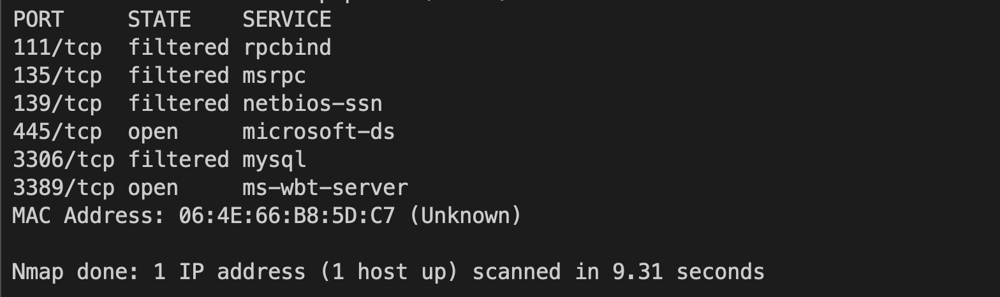
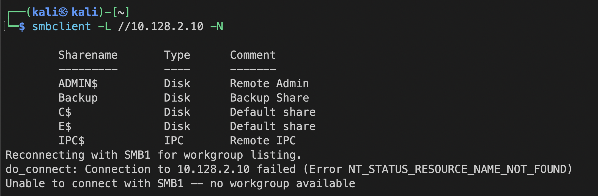
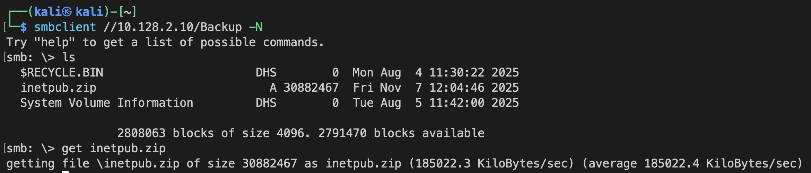
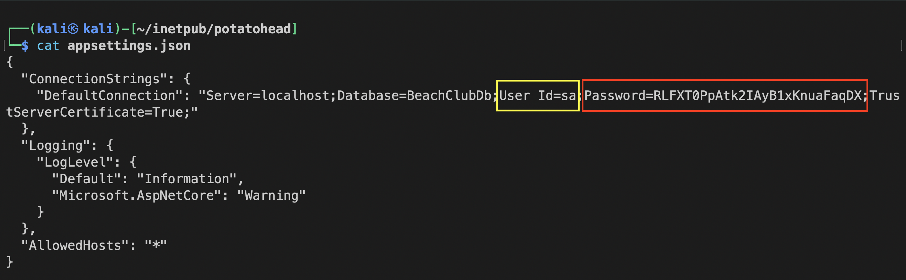
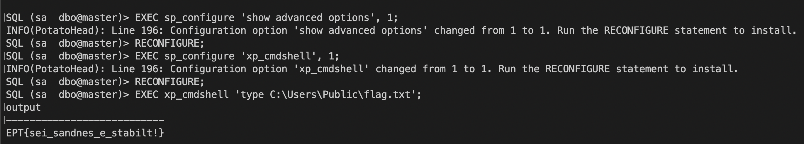

# PotatoHead (User) Writeup - Team B00S

`Author: Bludsoe`

Since this is a virtual machine we want to gain access to, we initiate by scanning the different services and ports that are open on the given IP address

Here we see two interesting services that are running. The first one is running on port 445, which is the microsoft-ds service. This is is a Service Message Block which we can connect to using smbclient. Since the state is OPEN, we can easily list the shares on the SMB for different to check if any is open.

By listing the shares, we see that the Backup share is open indicated by the fact that it does not have the "$" symbol. By connecting to the Backup share, we can check if there is any content we can download from there.

Here we see the inetpub.zip, which according to its size, contains a lot of files. So we decide to download this to inspect it further.

After downloading it and unzipping it, we go into the folder and list the content. Here we see a directory called `Potatohead` which is most likely the directory we want to check (considering the task name).

By going into this directory, we are able to find a file called appsettings, which contains some crucial information. 

Here we see two important things, we see that this is a database, and additonally we see that it has listed the user id and the password for the user id, meaning we can most likely connect to this database using those credentials. 

From the nmap scan, we also know that there is a mysql server running on the VM. We use python's impacket library which contains a mysqlclient script that we can use to connect to the mysql server running on the VM. By adding the credentials we found in the appsettings for the database, we are able to run the script and connect to the database.

After connecting to the database, we want to do three things

The first thing we do is `EXEC sp_configure 'show advanced options', 1;` and the reconfigure. What this does is that we change the value of advanced options to 1, indicating that we are now able to change advanced options. If the value of this setting is 0, we would not be able to change advanced settings. 

After changing this, we can now run `EXEC sp_configure 'xp_cmdshell', 1;`. What this does is that it changes the commandshell to be runnable, by setting it's value to 1. We want to be able to use this command to find the flag in the database. We reconfigure this new setting and then move on to the final step.

The final step is to run `EXEC xp_cmdshell 'type C:\Users\Public\flag.txt';`.  xp_cmdshell runs the provided string, in this case `type C:\Users\Public\flag.txt`, under a Windows shell. The command `type` prints the content of the filepath we gave, which should contain the flag. By running the command we were indeed able to get the content of flag.txt.

The flag for this task is: `EPT{sei_sandnes_e_stabilt!}`