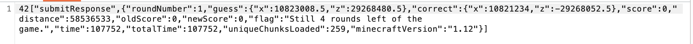
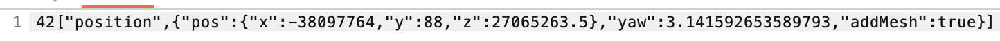

# Cubeguessr Writeup - Team B00S

`Author: Bludsoe`

## Initial comments

This task can be solved in several ways, as Minecraft has a lot of unintentional implementations that make world generation predictable. Due to not being able to understand the chunk-data and how to process it to get out the bedrock data, I was not able to generate a script for the bedrock pattern exploit. I will however share an unintentional way of solving this task using a bruteforce on the first guess, and then a guaranteed 5K guess for round 2, 3, 4 and 5. At the bottom I also show how this can be combined with NintendoAlex's bedrock pattern exploit solve to make the full exploit a lot faster ([click here to read](#complete-solve-nintendoalexs-bedrock-pattern-exploit--offset-exploit))

## Unintentional solve (teleportation offset exploitation)

This unintentional exploit was something I found during the day at EPT. This of course doesn't necessarily make the task any easier considering you have to bruteforce the first guess until you hit a 5K. But if you combine it with a bedrock pattern exploit it will make the exploit a lot faster considering you only have to do bedrock pattern calculations once, instead of for all 5 rounds. However, just bruteforcing the first guess will most likely (using a script), be quite a lot faster than manual structure recognition which is another possible solution for this task, and will guarantee a 25K score if you hit 5K on the first guess. 

How this exploit works is that because the player has to be moved around within the world, the WebSocket has to send some kind of packet to update the player position. Combining this with the `submitResponse` packet being sent after you've submitted the guess, you can find the next correct coordinate with 100% certainty.

We first look at the `submitResponse` packet, and especially the "correct" value of that packet



If we look at the "correct" value we see `"correct":{"x":10821234,"z":-29268052.5}`, which was the correct coordinates for the round you just played.

In a packet being sent almost directly after, we find information about how much the player has been moved in the x and z direction (the offset from the previous correct coordinates to the next correct). By looking at the packet we can see what this offset is



Here we see the values `"pos":{"x":-38097764,"y":88,"z":27065263.5}`

Now we can simply calculate the next correct coordinates by adding together the correct values from the previous round with the offset to the next correct coordinates for the next round. This is done as follows

```
(new_pos) = (correct_x + pos_x, correct_z + pos_z)
(x, z) = (10821234 + (-38097764), -29268052.5 + 27065263.5)
(x, z) = (-27 276 530, -2 202 789)
```

Then by submitting these two values for the next round, we are guaranteed a 5K


Doing this for round 2, 3, 4 and 5 (considering you have gotten a 5K on round 1), will guarantee a 25K score for the game and give you the flag. 

## Complete solve (NintendoAlex's bedrock pattern exploit + offset exploit)

Combining this with the solve from NintendoAlex (which you can read here: [GirlsNightOut solve](../Girls%20Night%20Out/README.md)) using the Bedrock Pattern Exploit, you can can pretty much do this task in minutes. Use the Bedrock Pattern Exploit (with GPU processing which is much faster than CPU) to find the correct coordinates for the first round, and then stop the program without actually submitting the coordinates. Then make sure to have a browser on the same proxy as BurpSuite, and pick up the WebSocket packets as you submit the coordinates for the first round, and _boom_ you can complete the rest of the game as described above to easily get a 25K game. NintendoAlex's has also included this offset exploit as an option in his script so that you don't even have to use BurpSuite at all. 

The flag for this task is: `EPT{5000_p0in7s_y3t_s7il1_n0_di4mond5?_smh}`