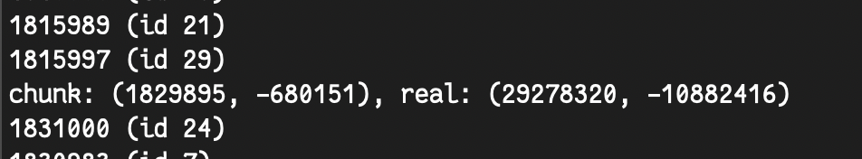
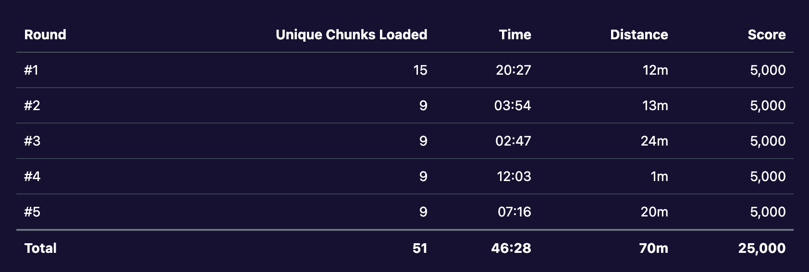

# 🔥 Cubeguessr 🔥
### Team: Iku-toppene 🐮
**Author:** Zukane, jole

```
I heard normal Geoguessr has turned too easy. After all, it is the same old world every time that we all have visited before. I heard that if you get a 5k score there might also be a flag or something.
```

### Challenge overview

In this CTF challenge, we are given a challenge link for a Geoguessr style game in Minecraft. Upon entering the game, we are met with an introductory info-message detailing how to play the game and what the goal is. 

The remote instance streams block-data from a real Minecraft server to our browser. The goal is to identify exactly where in the $30,0000,000 \times 30,0000,000$ block world you are. The flag is given by scoring a perfect 5000 in all five rounds, for at total of 25,000 points. The Minecraft server runs on the newest 1.21.4 version of Minecraft by default, but the server version can actually be adjusted in the game settings

### Minecraft's randomness

Minecraft is a procedurally generated game, where the world is generated using terrain generation algorithms based on PRNG seeds. A lot of players may be familiar with Minecraft's world seed, which is used for terrain generation among other things. There exists many different methods and strategies for cracking the Minecraft world seed based on how different blocks and structures are generated. Trees, flowers, the rotation/direction of blocks, etc. 

However, the goal of this challenge is not to find the Minecraft world seed. Instead, the goal is to find the player's coordinates. One approach may be to crack the world seed and search for certain constraints within that seed to get the coordinates. However, there is actually a more simple, direct approach.

Not all generation in Minecraft is based on, or rather seeded, with the world seed. There are some commonalities between all Minecraft worlds. The most well-known example of this, and what we used to find the player coordinates, is the formation of the bedrock patterns. Prior to Minecraft version 1.13, bedrock patterns are generated using a chunk-local PRNG which depends only on the chunk's X and Z chunk-coordinates, not the world seed. 

```java
long state = (chunkX * 341873128712L + chunkZ * 132897987541L) ^ 0x5DEECE66DL;
```

This means a chunk of generated bedrock-pattern can be used along with the PRNG parameters to crack the correct `chunkX` and `chunkZ` values which generated that specific pattern. With `chunkX` and `chunkZ`, the player coordinates can be found by multiplying by the chunk-size 16.

We quickly found ChromeChrusher's famous `bedrock.c` program: https://gist.github.com/LuxXx/32b132a73e4073b9d2fe2544fb09a15d. The program takes in a 16x16 array of 0s and 1s, indicating non-bedrock and bedrock blocks within the chunk. The top layer of bedrock at y=4 is used. On this layer, 20% of the blocks are generated as bedrock. We put the server on version 1.12.2 (likely any pre-1.13 will work), and began parsing the block-data.

### Extracting y-level 4

As mentioned before, the challenge service runs a Minecraft server on the remote instance and streams block-data from the game and into our browser. The `bedrock.c` program works best when the 16x16 bedrock layer is for a full chunk. We can create a web-socket to connect to the instance, and parse a chunk's block data on the `loadChunk` event. We look at all block with y-coordinate 4 in the chunk, and check the block ID against id 7, which is Minecraft's block ID for bedrock.

It is important to note that the `bedrock.c` program requires a north-facing chunk, which is in the -Z direction. 

```js
import { io } from "socket.io-client";

import Vec3 from "vec3";
import createChunk from "prismarine-chunk";

const ChunkColumn = createChunk("1.12.2");

const socket = io("https://ikutoppene-REDACTED-web.ept.gg", {
  transports: ["websocket"],
});

socket.on("connect", () => {
  console.log("Connected to server");
  socket.emit("startGame", {
    viewDistance: 2,
    minecraftVersion: "1.12.2",
  });
});

socket.on("disconnect", () => {
  console.log("Disconnected from server");
});

socket.on("loadChunk", (data) => {
  const chunk_pos = new Vec3(data.x, 0, data.z);
  let ch = ChunkColumn.fromJson(data.chunk)

  const p = new Vec3(0, 4, 0) // y-level 4
  let line = "";
  for (p.z = 0; p.z < 16; p.z++) {
    for (p.x = 0; p.x < 16; p.x++) {
      let block = ch.getBlock(p);
      if (block.type != 7) {
        line += "0,";
        continue;
      }
      line += "1,";
    }
    line += "\n";
  }
  console.log(line);
});
```

Running this JavaScript code connects to the server, and parses the loaded chunks:

```
0,1,0,0,0,0,0,0,1,1,0,0,0,0,0,0,
0,1,0,0,1,0,0,0,0,0,0,1,1,1,0,0,
0,0,0,0,0,0,0,0,0,0,0,0,0,1,0,0,
0,1,1,1,0,0,0,0,0,0,0,0,1,1,0,0,
0,1,0,0,0,0,0,0,0,0,1,0,1,0,1,0,
1,1,0,0,0,0,0,0,1,0,0,0,0,1,0,1,
0,0,0,0,0,0,0,0,0,0,0,0,0,0,0,0,
1,0,1,0,0,0,0,0,0,0,0,1,0,0,0,1,
0,0,0,0,0,0,0,1,0,0,0,1,0,0,0,0,
0,1,1,0,1,1,0,0,0,0,0,0,0,0,1,0,
0,0,0,1,0,0,1,0,0,0,0,0,0,0,0,0,
1,0,1,0,0,0,0,0,0,1,1,0,0,0,0,0,
1,1,0,0,1,0,0,0,0,0,0,0,0,1,0,0,
0,0,0,1,0,0,0,0,0,0,0,0,0,1,0,0,
1,0,0,0,0,0,0,0,0,0,1,1,1,1,0,0,
1,1,0,0,0,0,0,0,1,0,0,0,0,0,0,0,
```

This bedrock layer can then be copy-pasted into `int full_pattern[16*16] {}` in the `bedrock.c` program.

### Cracking the chunk coordinates

With the y-level 4 bedrock pattern parsed to an array, we can compile and run the `bedrock.c` program. However, there is a small problem. With a world-size of $30,0000,000 \times 30,0000,000$ blocks, there are $1.875.000 \times 1.875.000 = 3.515.625.000.000$ chunks to search. Running a single process on one pc will simply take too long. 

The `bedrock.c` program iterates over 1.875.000 "rings" starting from the world center, but allows specifying a start- and endpoint for the rings. We made a python script which splits the work among N processes. 

```python
import subprocess
import argparse

def run_bedrock_parallel(n, start, end, bedrock="./bedrock"):
    procs = []

    for i in range(n):
        cmd = [bedrock, "full", str(i), str(n), str(start), str(end)]
        print("Starting:", " ".join(cmd))
        p = subprocess.Popen(cmd)
        procs.append((i, p))

    print(f"\nLaunched {n} processes. Waiting for them to finish...\n")

    for i, p in procs:
        rc = p.wait()
        print(f"{bedrock} full {i} {n} {start} {end} finished with exit code {rc}")

    print("\nAll processes completed.")

if __name__ == "__main__":
    ap = argparse.ArgumentParser(
        description="Launch bedrock search in parallel across N shards."
    )
    ap.add_argument("N", type=int, help="number of parallel processes / shards")
    ap.add_argument("--start", type=int, default=0, help="ring start (chunks from spawn)")
    ap.add_argument("--end", type=int, default=1875000, help="ring end (chunks from spawn)")
    ap.add_argument("--bedrock", default="./bedrock", help="path to bedrock binary")
    args = ap.parse_args()

    if args.N < 1:
        raise SystemExit("Error: N must be a positive integer.")

    run_bedrock_parallel(args.N, args.start, args.end, args.bedrock)
```

jole has a quite strong CPU, so we initially ran with `N=32`. After around an hour, one of the workers had actually found the coordinates at 93.8% completion. 



At this point though, the instance had restarted multiple times due to instability. With a worst-case runtime of 1 hour per coordinate, we decided to crank up the compute. jole rented a VM with 48 cores, and Zukane rented two VMs with 64 cores each (this is really cheap, costing like $1 per hour). With four strong machines running many processes in parallel, the worst-case runtime per coordinate went all the way down to ~15 minutes. Also, note that we do not need the **exact** player coordinates. Just like in Geoguessr, there is some leeway to score a perfect 5000. The real coordinates for the chunk were more than close enough.

However, there were still some minor obstacles. Based on the README.md for https://github.com/DaMatrix/TerrainFinder, it turns out that `bedrock.c` does not work for biomes that do not use the `generateBiomeTerrain` method (like mesa, swamp, extreme hills) as well as biomes like beach and desert which use sand as filler. We were initially aware of this, but did not take any precautions while cracking. One of our locations ended up being in a desert, and we lost a run 3 rounds in.

One way to bypass this is to extract the bedrock layer for a chunk in another biome, and then manually offset the coordinates back to the player's position. However, in our winning run, we did not have to face any desert biomes again. After cracking the coordinates one by one, we were eventually met with the flag on the website:

```
EPT{5000_p0in7s_y3t_s7il1_n0_di4mond5?_smh}
```


