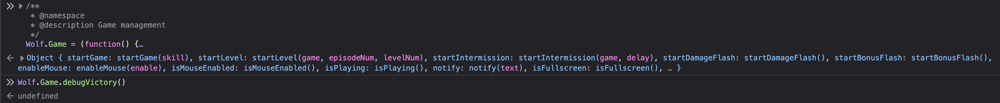
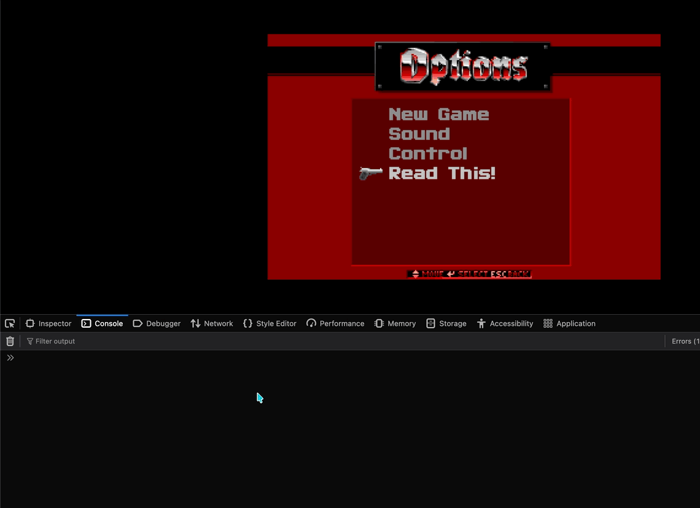

# Wolf3d Writeup - Team B00S

`Author: Bludsoe`

# Overview


By looking at the source code of the game, we find a JS file called `game.js` which contains all the main functions for running the actual game. Within this file there is some code that has been commented, so that it is no longer reachable. Most of these are debug-related, which means that we can most likely use these to easily bypass level completion.

# The exploit

We can use the web console to overwrite the Wolf.Game variable, so that it contains the debug-functions without them being commented. This makes all the debug functions reachable from the console, so that we can use these to automatically complete the game. One of these functions in particular is called debugVictory(), which basically just calls the intermission of the game that has been started (the intermission is the end-screen of the game). This is most likely where the flag will also be located, as the task description said we can find the flag by finishing the secret level. 

```JS
function debugVictory() {
    if (currentGame && currentGame.player) {
        Wolf.log("Winning!");
        Wolf.Game.startIntermission(currentGame);
    }
}
```

An important step to this game is to make sure that we overwrite the code before we start the secret level. This is because, if we don't overwrite the Wolf.Game code, it will use the old code to initialize the game, and so debugVictory() will not be defined.



Because of this we have to make sure that we overwrite the code before we start the level. We don't necessarily have to uncomment all the functions, but since they are all commented out in the same /*, it's easier to just remove the comment for everything. We also have to make sure that the exportation of the debug functions are also uncommented, so that we actually export the debug functions as well.



The flag for this task is: `EPT{Old_can_still_be_fun}`