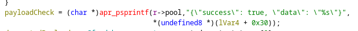
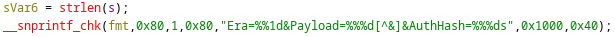
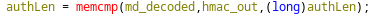

# Fiftiweb
## Challenge
*Author: nordbo*
*Points: 996*
*Solves: 5*

Try our new enterprise grade cookie authentication!

## Solution
*Author: Kriz*

This challenge provides us with an apache webserver which relies on a library written in C, **mod_fifti.so**. While we could inspect all the other included files in detail, I immediately decompiled the library as this was partially a pwn challenge, and the library showed the most important functionality.

### Initial analysis

Looking through the library in ghidra we can see several functions which look important. The ones that stood out to me the most were **cookieval_unwrap** and **cu_protected_handler**. I also briefly looked at the remaining files in the handout, which revealed the existence of the endpoints **/login** and **/protected**, as well as the users 'user' and 'admin'. From here i wanted to dive deeper into the authentication and authorization processes for the **/protected** endpoint.

### cu_protected_handler

Looking at this function, it becomes clear that our goal is to gain access to the **/protected** endpoint with a cookie that qualifies as an admin cookie. More specifically, we can see that there is a single branch which leads to us getting protected information.


Now that we have a clear goal, we need to find out what the conditions are for this data to be returned. The decompiled output looked quite messy and there were a fair amount of conditionals to go through, but just from going through each conditional, we can conclude with the following:
 - The pointer to the decrypted cookie must not be NULL.
 - The decrypted cookie must contain 'user='
 - The decrypted cookie must contain 'role=admin'  

Once all these conditions are satisified, we should be able to get the flag. Now we need to move on to the cookie itself, and figure out its structure.

### cookieval_unwrap

This function was also quite messy when decompiled, but a few things become clear immediately. From this function we can determine the format of the cookie and how the payload is encrypted.



The __snprintf_chk call above shows us the format of the cookie (this could also be revealed by logging in as 'user' and checking your browser cookies). This shows us that the cookie uses an authentication hash to protect the integrity of the payload.  

I won't go into details on the decompiled code here, but to sum up the most important parts of this function:
 - Both the payload and the authentication hash are url decoded and then base64 decoded. 
 - The authentication hash is verified with a memcmp call
 - If the authentication hash verification is successful, the payload is decrypted with 3DES CBC.
 - If any part of this function fails, the pointer to the decrypted cookie becomes NULL, which will cause **cu_protected_handler** to return an error every time.

### Identifying the vulnerabilities

When reversing the **cookieval_unwrap** function, my eyes were immediately drawn to the memcmp which verifies the HMAC. The 3rd argument to this function is the amount of bytes to compare, and this was defined by a local variable. If we could cause this variable to be 0, the memcmp would compare 0 bytes and therefore always be successful. 



It never became entirely clear to me how this variable was defined as there was some addition involved based on function outputs. The check still looked very suspicious, so i started messing with it to see if i could pass it without providing a legitimate HMAC.  

I attempted to cause the length of the auth hash to be 0 with several techniques. First i tried adding A's to the beginning of it, which would become null bytes when decoded. This did not work. I kept trying to inject actual null bytes into the cookie, but this did not work either. Finally, I remembered that both the payload and hash were url decoded at the beginning of the unwrapping function. For this reason i attempted to swap the auth hash with %00. This also failed, but i kept trying and eventually found that a url encoded newline would pass the check. The cookie now looked like this:
`Era=0&Payload=nfxrW8ncE95QBb/BT3plhRWjWCO2MfabWLv6ZpnLBjSpSDy7avt/HaNU5WC7AMTx&AuthHash=%0a`

Now, all that remained was to forge a payload which, when decrypted, satisfies the conditions in **cu_protected_handler**.

This is where my lack of crypto skills caught up to me. As we already knew the plaintext of the cookie payload, i thought we could perform some sort of known plaintext attack. Considering the cookie uses a CBC encryption, we could for example overwrite a block in such a way that the block after it is decrypted to a plaintext of our choice. However, 3DES uses a block size of 8 bytes, and the string we would need to encrypt ('role=admin') is 10 bytes. I realized that the protected handler gives us different outputs based on whether cookie decryption was successful, which means we could perform a padding oracle attack. Sadly, at the time of the ctf, i was not 100% confident in this approach and gave up fairly quickly when it didnt appear to work. For this reason, we did not successfully solve the challenge in time, and this is where we left off.

### Grave mistakes

Revisiting the challenge a few days later with a clear head, I once again attempted to implement a padding oracle attack as this seemed to be the most likely solution. This is when i noticed the silly mistakes i had made during the ctf.

Take a look at the following oracle function, which I passed to the padding oracle module:
```py
def attempt(payload):
        cookie = f"Era=0&Payload={base64.b64encode(payload)}&AuthHash=%0A"
        res = requests.get(endpoint, cookies={"enterprise_grade_cookie":cookie})
        return "no valid session" not in res.text
```
Do you see the issue? Neither did I. I forgot to consider that base64.b64encode() returns a bytestring, which means that when it is placed in a format string without being decoded first, will look like b'\<data\>'. This means the oracle function returned false every time :sagde:

Apart from this, I also had to run the script from the EPTbox instead of own machine to prevent what i believe was rate-limiting. 

Running the updated script on the EPTbox allowed the padding-oracle module to work just fine, and after about a minute i got the flag.

```bash
┌──(kali㉿kali)-[~/kriz]
└─$ python solve.py
[progress] block 1/2 encrypted 1/8 bytes
[progress] block 1/2 encrypted 2/8 bytes
[progress] block 1/2 encrypted 3/8 bytes
[progress] block 1/2 encrypted 4/8 bytes
[progress] block 1/2 encrypted 5/8 bytes
[progress] block 1/2 encrypted 6/8 bytes
[progress] block 1/2 encrypted 7/8 bytes
[progress] block 1/2 encrypted 8/8 bytes
[progress] block 2/2 encrypted 1/8 bytes
[progress] block 2/2 encrypted 2/8 bytes
[progress] block 2/2 encrypted 3/8 bytes
[progress] block 2/2 encrypted 4/8 bytes
[progress] block 2/2 encrypted 5/8 bytes
[progress] block 2/2 encrypted 6/8 bytes
[progress] block 2/2 encrypted 7/8 bytes
[progress] block 2/2 encrypted 8/8 bytes
b'83ZVeiuTfzFkc2HoN+BISWuBYKYoomY1'
b'\xf3vUz+\x93\x7f1dsa\xe87\xe0HIk\x81`\xa6(\xa2f5'
Era=0&Payload=83ZVeiuTfzFkc2HoN+BISWuBYKYoomY1&AuthHash=%0A
{"success": true, "data": "EPT{c00k13_4uth_m4st3r_2025}"}
```

Moral of the story: test your damn code properly

While it's very annoying that I was not able to solve this challenge during the ctf, it was undoubtedly one of my favorite challenges. The combination of categories worked very well and it's nice to get a unique challenge which really forces you to use your head (or ikublood alternatively:)).