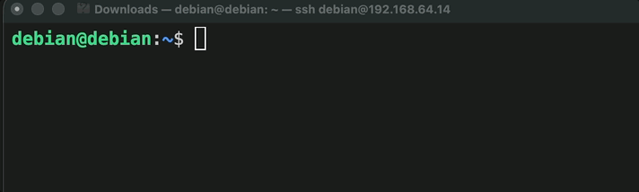
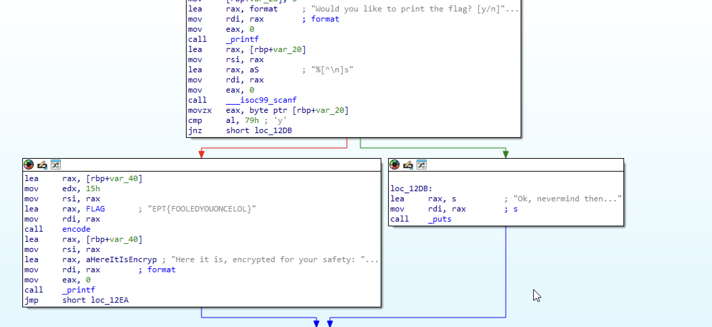
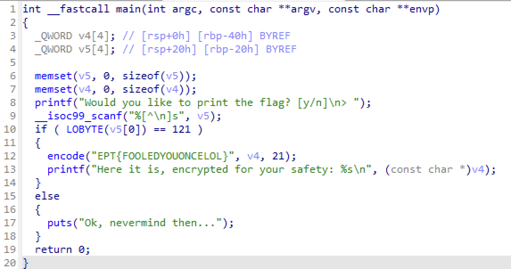

# Flagprinter Writeup - Team B00S

`Author: Bludsoe`

For this task, you could solve it in a couple ways, some easier than others.

### Using Linux's `string` function

Given the task description `Flags are usually strings in files, matching the pattern "EPT{...}" where "..." is some text.`, we could basically just assume that the flag was a string in the binary, so by just printing out the strings contained in the binary, and then using `grep` to specify the EPT-flag format, we could easily print out the flag string

### Using Ida Hex View

By decompiling the binary in IDAFree, you could easily spot the flag as a string in the Hex View, and just copy paste it from there, no need for any functions or a Linux computer if you don't have one.

### Using Ida Pseudocode

After decompiling the binary in IDAFree, you can use it to create a pseudocode for the binary to better understand the functionality of the code. Using the pseudocode you can again just read the flag. 

The flag for this task was: `EPT{FOOLEDYOUONCELOL}`