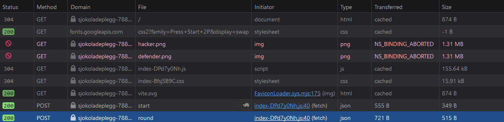
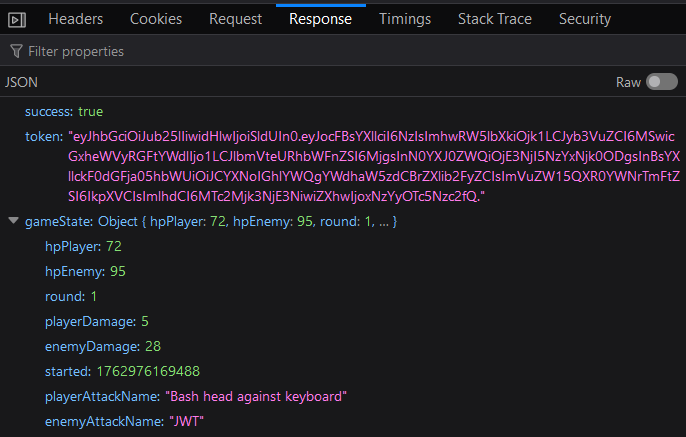
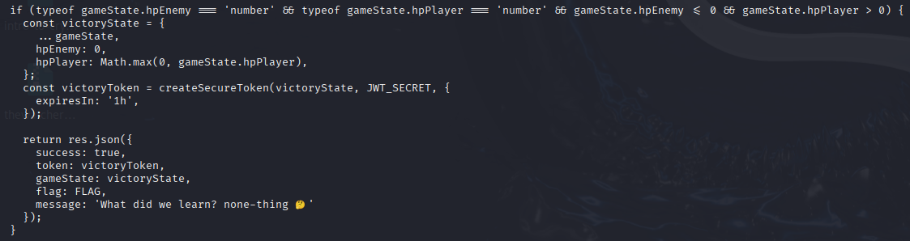
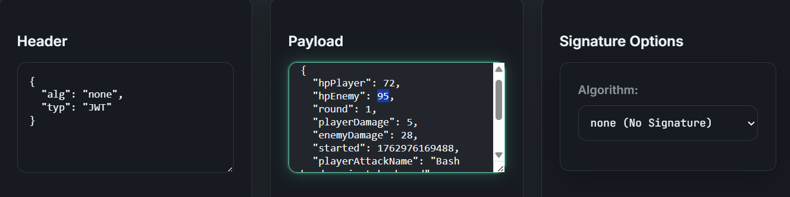
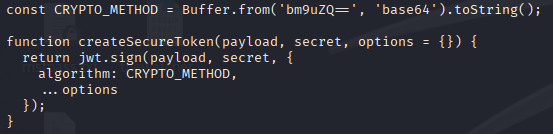
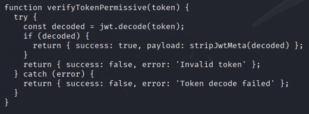
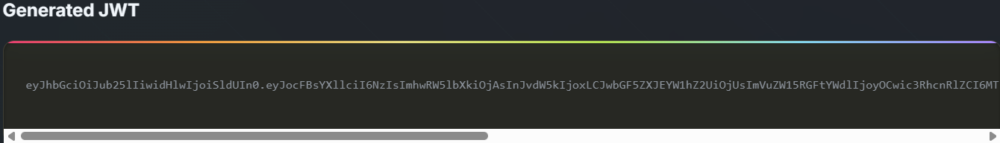
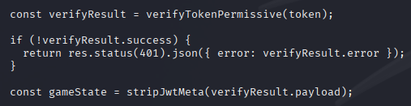
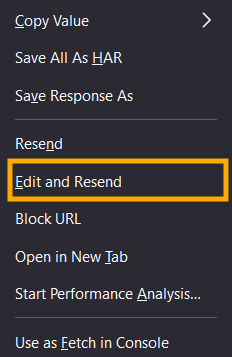
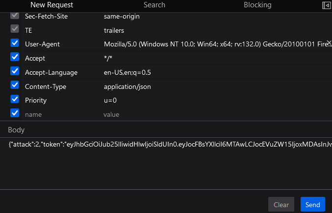

# Writeup: Hackermon
**Author:** Seppuku_FF1+4 (SamiFF1+4)  
**Team:** Sjokoladepålegg  
**Category:** Web

## Summary
The server accepts and trusts JWT payloads without verifying signatures, allowing client-side manipulation of game state. By editing the JWT `hpEnemy` value to `0` and resending the request the server returns the flag.

We will be using the Inspect DevTool in Firefox for this write-up. 

We can use the POST file "round"'response from Network tab:

Clicking on it, we observe the Response:

This is the JWT token from "round" which is round 1 in this case. We want to beat the game. 
The idea is to manipulate the enemy's "hpEnemy" to 0. As we see in the /server/index.js, the flag is returned if we meet that criteria:

We load the JWT token into https://jwtauditor.com/ using the JWT Editor in order to edit the payload property "hpEnemy", is my case 95, to 0:

/server/index.js reveals that the 'alg:' is set to "none" from the base64 string '"bm9uZQ=="' , allowing us to build and use our own payload without any type algorithm property:

It also reveals that it doesn't need any signature for verification:

We then click "Generate JWT" to get the new JWT token:

/server/index.js also reveals that the gameState's payload will be trusted anyway:

We proceed to right click the "round" and use Edit and Resend tool:

You'll be able to edit and replace the JWT token in the New Request tab:

Paste the new generated JWT token (don't forget the dot at the end), and Send the payloa and you'll get the flag in the Response:

Summary:
The exploit works because the server does **not** verify JWT signatures. Looking at its source code, we can se the function `verifyTokenPermissive` calls `jwt.decode(token)` which only base64-decodes the token payload.
It does not validate the signature or the `alg` field. Combined with the server signing tokens using `alg: "none"` (see `CRYPTO_METHOD`),  we can generate a custom unsigned token with `hpEnemy: 0` and the server will accept it and return the flag. 
