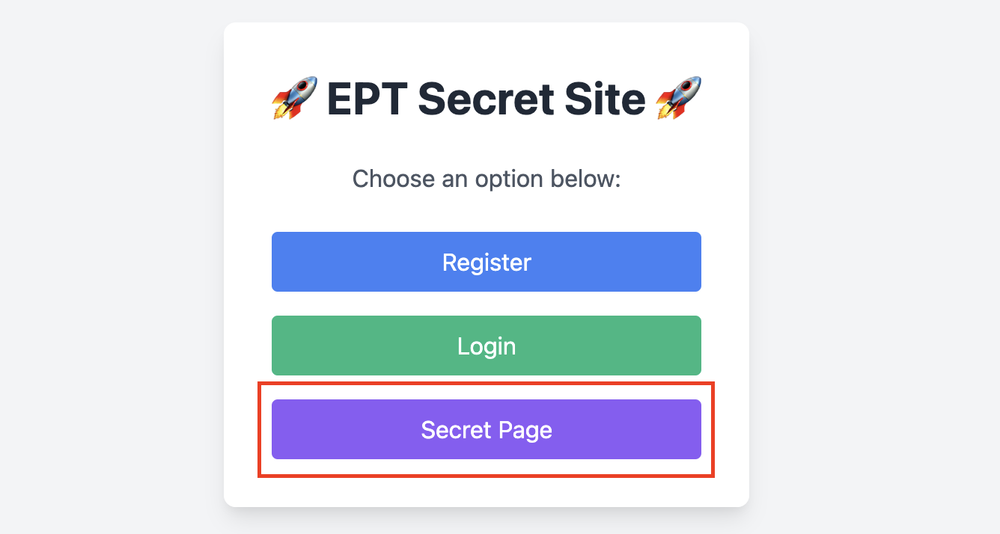
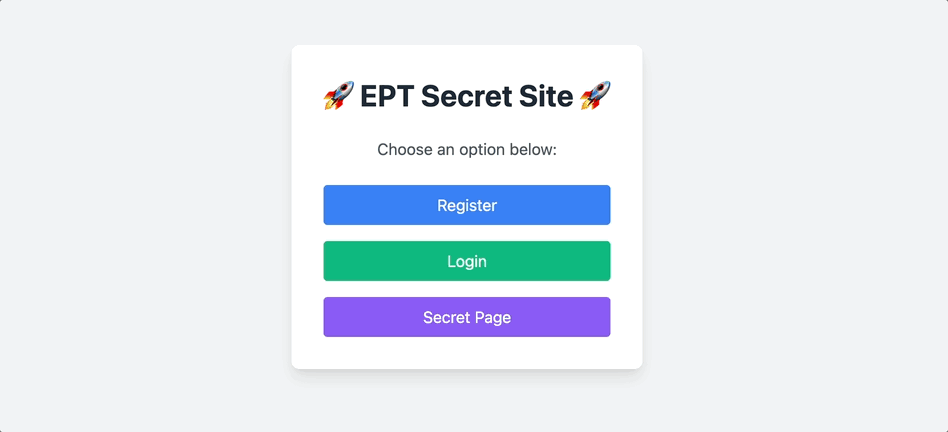
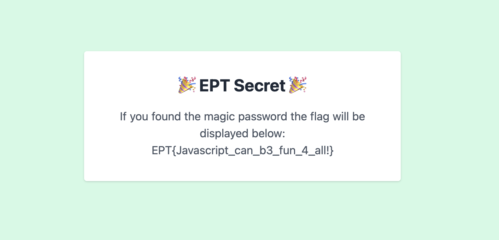

# ScriptMe Writeup - Team B00S

`Author: Bludsoe`

When entering the webpage you are prompted with three choices, you can either register, login or click on the secret page.



However, when trying to enter the secret page without being logged in using the correct password you are not allowed to enter the page. So the next thing we tried was to register a user, and then log in using this to then attempt to access the secret page.



When logging in with this new user, we are prompted with the error that we need to have the magic password, to be able to gain access to the secret. Since the description was saying `Sometimes you need to look at what is going on in the browser to find a flag.`, we looked in the network tab when logging in. Here we noticed something important; there was a GET request to a part of the website using `/key`. 


By accessing this part of the website, we were able to find a Base64 encoded string.


By using BurpSuite's Base64 decoder, we were then able to decode `VGhpcyBpcyB0aGUgbWFnaWMgcGFzc3dvcmQh` to `This is the magic password!`.

The first thing we then tried was to create a new user having the password `VGhpcyBpcyB0aGUgbWFnaWMgcGFzc3dvcmQh`, and then logging in using this. However, we were still prompted that we needed the magic password to get the secret. To figure out how the magic password was checked, we looked at the JS part of the website code

```JS
const keyres = await fetch('/key', {
    method: 'GET',
    headers: {
        'Content-Type': 'application/x-www-form-urlencoded',
    }
    });
const key = await keyres.text();
const expectedKey = toBase64(password.trim());
// Set the cookie manually (if server didn't set one)
if (key.trim() === expectedKey ) {
document.cookie = 'magic=' + expectedKey + '; path=/';
    } else {
    document.getElementById('nokey').classList.remove('hidden');
    return;
}
```

Here we can see that the JS fetches the content of the `/key` and then compares this to the your password after trimming and encoding it using Base64 encoding. From this, we understood that the magic password was actually `This is the magic password!`, and by logging in using an account with this password, we got access to the secret page and find the flag.



The flag for this task was: `EPT{Javascript_can_b3_fun_4_all!}`